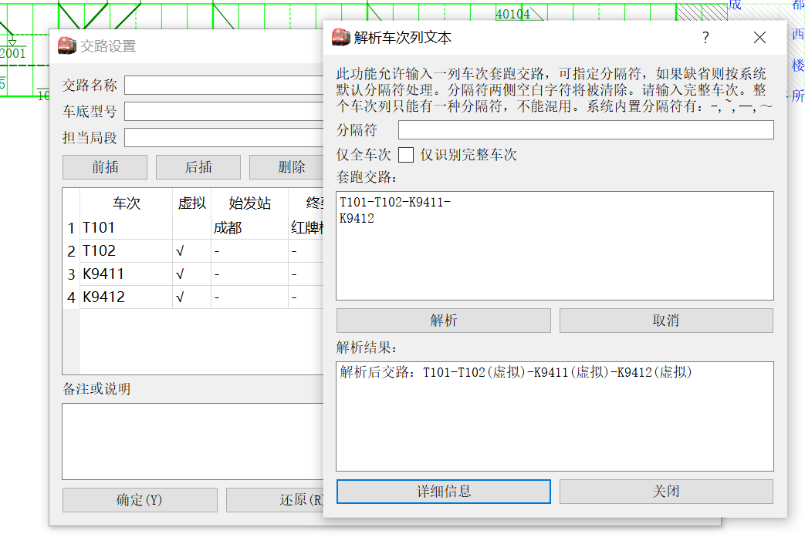

# 高级数据管理

除了最基本的线路里程、标尺、车次时刻数据外，本系统还支持更加丰富的数据。这部分在最初接触软件时或许不大常用，但如果需要用到，可以参考本篇文档。

## 列车数据

### 运行线管理

自本系统`2.0.0`版本开始，“车次”和“运行线”之间不再是一一对应的关系，而是**一趟列车可以有任意多的运行线**。这是从`1.x`到`2.x`版本的关键变化，也是本系统与ETRC系统的重要区别之一。一条**运行线**是指同一列车在本线上运行的一段连续、单向的区间，在图上用一条线表示。如图所示，


图中`40001`次成都-成都西区间，红牌楼-石羊线路所区间分别是两段运行线；图中`40103/4`次成都-红牌楼，红牌楼-成都西分别是两段运行线（因为运行方向变了）。这种情况下，40103次在成都-红牌楼间是下行，红牌楼-成都西间是上行，也即**上下行不是列车的性质，而是运行线的性质**。

当选中车次时，该车次的所有运行线都会被同时选中。例如上图中的40001次。

?> 虽然如此，但在绝大多数情况下所需要处理的运行线情况是比较简单的。这样的分段以及折返的情况是比较少见的。并且，对于大多数的情况，自动运行线管理已经能够处理的比较好，因此不必深究本节。但若要处理的情况比较刁钻，或者遇到问题，可以参考本部分。

运行线管理有两种方式，即**自动管理**和**手动管理**。一般情况下，我们建议使用自动管理，而仅仅用手动管理处理极其特殊的情况。

#### 自动管理

本节介绍运行线自动管理的逻辑。有关设置项是运行图设置中的**最大跨越站数**，参见[运行图显示控制](main/overview.md#运行图显示控制)。

对于没有设置过运行线规则的车次，系统**在铺画运行线时**，按照以下规则处理。

- 如果相邻的两个**可铺画站点**间跳过的车站数超过了“最大跨越站数”的设置项，则在这个区间断开运行线。

  > “可铺画站点”是指同时在<u>车次时刻表</u>和<u>本线站点表</u>中出现的站。最大跨越站数的统计，包含车次时刻表中不在本线的站和本线站表中<u>应该在而不在</u>车次时刻表中的站两部分。
  >
  > 例如，如果本线站表和车次时刻表中的站序如下表所示：
  >
  > | 线路站表 | 车次时刻表      | 匹配情况 |
  > | -------- | --------------- | -------- |
  > | 达州     | 达州 00:00      | 匹配     |
  > | 覃家坝   |                 | 不匹配   |
  > |          | 渡市 00:10/12   | 不匹配   |
  > | 三汇镇   | 三汇镇 00:23/25 | 匹配     |
  > | 土溪     | 土溪 00:40/...  |          |
  >
  > 则对于车次而言，达州、三汇镇是两个相邻的可铺画站点。两站点间的跨越站数为2。如果系统设置的“最大跨越站数”为1或者0，则达州和三汇镇间的运行线会断开。
  >
  > 对于当前方向而言，本应不通过的站不计入跨越站数。例如，对于上行的运行线而言，下行单向通过的站理应不在时刻表上，故不计入跨越站数。

- 如果区间运行方向改变，则断开运行线，且从折返站开始重新铺画运行线。上一段运行线不带结束标签，下一段运行线不带开始标签。因此从运行图上来看，运行线是连着的，但实际上是属于两段运行线。

- 如果按照前两段规则计算的某一段运行线中有效站数小于2，则取消这段运行线。

?> 这样的管理模式适用于时刻表较完整的情况，如果输入的时刻表是不完整的，例如只输入了停车站的时刻，其他站没有输入（但其实是经过了本线的，只是默认通过而没有填时刻），则按照自动运行线管理规则，运行线可能被断开。此种情况下，可将“最大跨越站数”设为一充分大的数字。

!> 引入运行线管理机制后，列车在本线运行的里程（及依据里程计算的均速）、列车入图出图方向等数据的计算都依赖于运行线信息。如果没有铺画过运行图，也没有手动给出运行线信息，则这些数据无法计算。

#### 手动管理

为了应对特殊情况，我们同样提供了运行线手动管理方式。手动管理方式见`当前车次设置`停靠面板（`ctrl+I`），在“运行线管理”栏，可以选择是否要自动管理。点击`设置`弹出对话框如下图所示。


左侧显示的是本次列车的站点；右侧表中是运行线信息，一行是一条运行线，可以设置运行线方向，是否设置起始结束标签。

在左侧选择一组车站，点击“添加”后，将选择的第一个站至最后一站之间都作为一条运行线的数据。请注意运行线管理不可以重复，且必须按顺序添加。如果添加错误，只能删除再重新添加。

!> 此设置项仅在手动管理模式下生效。如果在自动管理下编辑，则重新铺画运行图时，手动管理的数据无效，且会被系统自动管理的内容覆盖。

?> 在手动管理模式下，系统铺画运行图后，仍会对运行线信息做一些调整，例如剔除掉不能在本线铺画的区段。但用户指定的分界点不受影响。

?> 一般来说，我们建议用自动管理，除非个别情况下自动管理失效，再用手动管理来调整。

### 列车类型系统

相比ETRC，pyETRC系统的一大特色是所有数据都要有依据，不会随意为用户指定参数，或者即使给了默认参数，也可以由用户调整。列车类型系统是这条原则的一个例子。列车的类型系统和是否为客车，都可以由用户规定。

?> 本系统已经预制了较为完整的国铁类型系统。正常情况下，无需用户修改。但如果用户需要添加自己的类型规则，或者不使用国铁类型系统（例如，用本系统来进行城市轨道交通运行图分析），则可以修改或重新设计类型系统，此时可以参阅本节内容。

#### 概述

列车类型系统主要包括两个方面，

- 列车种类。是指对于每一个车次，它属于哪一类车次，例如`快速` `特快`。列车种类有两种获取方式：
  - 针对每个车次手动设定。此项可在`当前车次设置`面板中设定。
  - 根据车次形式，使用**正则表达式**推定。详见后文。
- 是否为客车的属性。除列车种类外，所有车次还可分为`客车` 和`非客车`两大类。类似的，也有两种方式获取：
  - 针对每个车次手动设定。此项可在`当前车次设置`面板中设定。
  - 根据列车种类自动推导。可以规定每一种<u>列车种类</u>是否属于客车。详见后文。

#### 列车种类判定及其应用

本系统列车种类判定的**唯一**依据是`类型管理`功能设定的类型表。设置项见`运行图设置`停靠面板（快捷键`ctrl+G`），点击`类型管理`后的`设置`，弹出对话框如下图所示。


表中每一行是一个**种类判据**（名称可以重复），第二列是**全车次**应当符合的正则表达式。关于**正则表达式**（regular expression）的语法，请自行查阅有关资料。

表中各行的顺序表示优先级关系。当要对一趟车的全车次（例如：`5648/5`）做类型判断时，**从上到下依次**用正则表达式匹配，如果符合，则判定车次属于第一列所示的类型，并结束判定过程。

第三列规定该种类型是否属于旅客列车类型。

?> 在`当前车次设置`停靠面板中，如果`列车种类`一栏留空，则点击“确定”时，由本节所述规则判定种类。

?> 当修改客车类型系统时，已有列车的类型不会随之变化。通过菜单栏`工具->重置所有列车类型`可按现有规则，对现有所有车次，按照以上规则重新设置类型信息。

列车种类数据的应用主要体现在：

- 按列车种类筛选车次。详见[通用车次筛选器](main/review.md#通用车次筛选器)。
- 自动设置列车运行线颜色。在`运行图设置`和`系统默认设置`面板（参见[运行图显示控制](main/overview#运行图显示控制)），可以通过`默认颜色设置`指定各个类别车次所对应的默认运行线颜色。
- 选择要显示运行线的车次。详见[显示车次筛选](main/review#显示车次筛选)。
- 在[车站时刻表](main/review#车站时刻表)、[车次列表](main/overview#车次列表)等处显示，供用户参考。

#### 客货车判定及其应用

对某一车次是否为客车的判定主要依据的是类型系统中各个种类是否为客车的设置项，参见[列车种类判定及其应用](#列车种类判定及其应用)。

?> 在`当前车次设置`停靠面板中，如果`列车种类`后的`旅客列车`选择框为半选中（Partial Checked）状态，则依据列车种类，自动判定是否为客车。且这个判定是动态的，即如果改变了该种类是否为客车的选项，每个该种类下的车次都受影响。但若将此选项强制勾选或者不勾选，则不再受列车种类调整的影响。

?> 使用`工具->自动设置是否客车`可以对所有列车按照以上规则设置是否属于客车，**且这个判定是静态的**，即直接设定为“是”或者“否”，不再保留“自动”。理论上，进行本操作后，可以省去每次调用“是否客车”数据时的判定过程，但**此操作不可撤销**，需谨慎操作。

客货车判定目前主要应用于：

- 自动决定运行线宽度。即决定默认情况下使用`默认客车线宽`还是`默认货车线宽`。此设置项参见[运行图显示控制](main/overview#运行图显示控制)。
- 自动决定车站营业性质。详见[是否营业及其应用](#是否营业及其应用)。

## 天窗

本系统中的天窗数据仅作提示用，作为线路数据的一部分，可以在图上画出，但暂不包含更多的逻辑上的功能。本系统支持每条线路可以有两套标尺数据，即综合维修天窗和综合施工天窗。两套数据互相独立。

可从`窗口->天窗编辑`菜单，或者用快捷键`ctrl+1`（数字`1`）打开或隐藏天窗编辑停靠面板。编辑界面如下图所示。


其中`上下行分设`选项的意义同[标尺数据](main/overview#标尺数据)中的相同选项。勾选或取消`显示天窗`，可控制显示/隐藏下行和上行天窗。天窗在运行图中的展示效果如下图所示。


其中，下行天窗用左上->右下的阴影线标注，上行天窗为右上->左下，上下行交叉区段，或者上下行不分设的区段，则为交叉阴影线。上图中标注天窗的三个小时区间，自左向右分别为下行、上下行交叉、上行。

综合维修天窗用灰色阴影线，并无背景色；综合施工天窗在蓝色阴影线的基础上，添加浅灰色背景。上图中，成都~红牌楼区段为综合维修天窗，红牌楼~石羊线路所区段为综合施工天窗的样例。

#### 编辑技巧

考虑到输入时间比较麻烦以及天窗数据的一般规律性，我们在天窗编辑面板中设计了一些快速操作方法。这些快捷操作可以通过右键菜单调出，也可以用相应快捷键调用。具体如下：

- 复制本行数据到下一行（`Alt+C`）。将当前行数据复制到下一行，同时光标移动到下一行。
- 复制数据到本方向所有行（`Alt+Shift+C`）。重复上一项操作，直至本方向（上行或者下行）最后一行。也就是说，对于垂直天窗的情况，直接编辑第一行，然后用此功能复制就可以了。
- 计算结束时间（`Alt+E`）。按照表格上方设定的**默认时长**，根据本行设定的开始时间，加上默认时长，填写结束时间。适用于天窗时长基本固定但并非垂直天窗的情形，此时只需要编辑各个区间的开始时间，再用本功能计算结束时间。
- 计算开始时间（`Alt+R`）。和<u>计算结束时间</u>类似，只是本功能通过结束时间，反推开始时间。
- 计算所有结束时间（`Alt+Shift+E`）。对每一行应用<u>计算结束时间</u>。
- 计算所有开始时间（`Alt+Shift+R`）。对每一行应用<u>计算开始时间</u>。

## 车底交路

### 概述

本系统允许每趟车属于**至多一个**车底交路。之所以强调车底交路，是为了和机车交路相对应，也就是仅能有至多一个交路，而不能分段设置（即换挂）。

一个交路是一组车次的序列。序列中的车次可以是属于本运行图的车次，也即本运行图中有该车次的时刻信息，称为**实体车次**；也可以是不属于本运行图的车次，也即**虚拟车次**。

### 交路编辑界面

使用菜单`窗口->交路编辑`或者快捷键`ctrl+4`可以打开或者隐藏交路编辑停靠面板。在交路编辑面板中双击一行，或者点击`编辑`或`添加`，弹出针对单个交路进行编辑的对话框。交路编辑停靠面板及对话框的界面如图所示。


其中，`交路名称`必须是唯一的非空字符串；而`车底型号` `担当局段` `备注或说明`则可以是任何内容，仅作提示用。

`识别车次`的作用是重新判定实体车次与虚拟车次。这将遍历所有车次，对于符合实体条件的车次（即本运行图中可以找到该车次的时刻信息）则设置为实体车次；否则设置为虚拟车次。实体车次和虚拟车次的来源参见[添加车次](#添加车次)和[交路字符串解析](#交路字符串解析)。`批量识别`将对所有交路应用以上操作。

`解析文本`和`批量解析`详见[交路字符串解析](#交路字符串解析)。

`连线`选项指出是否希望在该车次的运行线**开始处**绘制与上一车次之间的连接线。具体逻辑参见[运行线连接](#运行线连接)。

勾选`高亮`，可将该交路中所有车次（及车次连接线）都加粗显示出来，显示效果同选中车次。

### 添加车次

在交路设置的对话框中点击`前插`或者`后插`则弹出添加车次的对话框。添加车次分为添加实体车次和虚拟车次两种情况。添加实体车次的界面如下图所示，


首先在`车次`栏输入，按`Tab`键后，右侧的下拉菜单中弹出符合条件的车次，默认选中第一个，并自动填写始发站、终到站等信息。点击`确定`即可完成插入。

!> 只有下拉菜单中选中的车次才是有效的。如果找不到车次，或者选择的车次已经属于一个交路，则弹出告警信息。此时不能插入车次。

?> 极个别情况会出现数据不同步的情况。也就是车次并不属于某个交路，但因为某些操作，导致无法添加到交路，提示“该车次已经属于xxx交路”。这种情况下，可以到`当前车次编辑`（`ctrl+I`）面板中，点击`车底交路`后的`清除`来强制删除。

虚拟车次的插入比较简单，只需要输入有关信息即可，不再附图。请注意插入时并不会检查车次是否唯一，也不会检查车次是否属于当前运行图。

### 运行线连接

运行线连接和股道占用分析是交路数据的两项最重要的应用。这里介绍运行线连接的逻辑。股道占用分析详见[车站股道图](main/review#车站股道图)。

运行线连接是指，当交路前后相邻的两个车次符合一定条件时，在运行图上以虚线连接其运行线端点，如下图中`1005`次与`1002`次之间的连线所示。


两车次间绘制车次连接线，**当且仅当**下列条件**同时**满足：

- 添加车次时，或在交路设置界面，勾选了`开始处连线`或者`连线`选项。

- 前序车次和后序车次在**本线**同一车站终到、始发。

  ?> 关于终到、始发站的判定，可参见[始发终到站匹配规则及其自动适配](main/modify.md#始发终到站匹配规则及其自动适配)，或者也可以简单地理解为，前序车次的`终到站`设置项必须和时刻表最后一个站相同，后续车的`始发站`设置项必须和时刻表第一个站相同，且这两个站都是**本线**同一个站。

交路连线采用虚线，颜色同**后续车**的运行线颜色，且虚线叠压在车站水平线上。

### 交路字符串解析

除了手工一个个添加车次到交路外，本系统还支持从特定格式的交路字符串解析交路的功能，这也是用文字表述交路的一般方法。交路应当是以一定分隔符分开的车次串，例如

```
D354/1—上海虹桥入库—D352/3—成都东入库—D354/1
```

分隔符可以由用户指定，或者用默认的`-` `—` `~`三种之一，但同一次解析中，分隔符只能有一种。含有`入库` `过夜`等关键词的分隔项目，将被排除掉；如果最后一个车次和第一个相同，也将被排除掉。如上例中的交路将解析为：

```
D354/1—D352/3
```

如果车次能在本运行图中找到时刻信息，且没有属于其他交路，则判定为实体车次；否则为虚拟车次。

交路解析有两种方式。

#### 单交路解析

在交路设置页面中，点击`解析文本`弹出对话框，如下图所示。



在`套跑交路`中输入字符串即可解析。输入中**可以换行**，换行符将被忽略。点击`解析`显示结果，同时插入到交路中。若点击`详细信息`，则可看到每个车次解析的具体情况，上例中的详细信息为

```
[info]在交路None中解析车次信息字符串
[info]添加实体车次Train T101 (成都->红牌楼) 
[warning]车次T102不存在，设为虚拟车次
[warning]车次K9411不存在，设为虚拟车次
[warning]车次K9412不存在，设为虚拟车次
```

#### 批量解析

从菜单栏`工具-批量解析交路`或者快捷键`ctrl+P`可以打开批量解析对话框，如下图所示。


左侧的编辑框中一行是一个交路；点击`解析`后在右侧产生结果。解析的结果立即生效，并添加到交路表中。

`保留纯虚交路`控制是否要保留所有车次都为虚拟车次的交路。如果不勾选，则完全虚拟交路会被排除掉，例如完全不在本线的交路，或者完全重复的交路。作为推论，如果不勾选此项目，则在输入的交路不变、第二次点击`解析`时，产生的结果为空白。

### 交路图

点击交路设置对话框底部的`交路图`弹出对话框，如下图所示。


这是按照“中国动车组交路查询”绘制习惯给出的交路示意图，支持调整大小，可导出`PNG`和`PDF`格式。

若不勾选`扫描整个时刻表`，则绘制交路图时，认为每个车次全程运行时长小于24小时，也即至多跨越一天。若勾选，则会遍历整个时刻表，每当发现下一站时刻在上一站时刻之前时，就认为跨越了一天。此种情况下，整个时刻表不能有错误（尤其是顺序错乱的错误）。

系统会自动产生各个车站在纵轴的相对位置。由于实际交路的复杂性，自动产生的位置常常不合理，例如上例中，自动产生的位置是苏州城际场在南京城际场的下方。此时可以手工调整，在左侧表格中输入站名和相对位置。点击`重新铺画`按照表格中定义的顺序重绘交路图；点击`自动铺画`抛弃表格中的数据，而恢复到初始时系统自动给出的位置。

?> 所有输入的站名都会被画在图上，即使这个站实际上没有车始发终到。另一方面，如果站表中缺少某个有始发终到车次的车站，系统会自动补上。

## 列车停站数据

在真实的铁路生产环境中，列车停站有多种情况的分别，例如会让、越行、技术停车（换挂、换乘）、办客、通勤等。在pyETRC的建模中，我们将问题简化为营业停车和不营业停车两种情况。考虑到实际情况，又分为客车和非客车（或者统称为货车）两类。在一般的应用场景下，不大需要处理这一点；但某些情况下可以考虑使用。

### 是否营业及其应用

无论是否是客车，其在某个站是否营业的设定都在`当前车次设置`停靠面板中。勾选为营业，不勾选为不营业。如果营业，则该站的站名变为红色。

在`线路编辑`停靠面板中，有`办客`和`办货`两列，表示该站是否能办理客运业务或者货运业务。

#### 营业自动设置

点击`当前车次设置`页面中右下角的`自动营业`按钮，将按照以下原则重新设置本次列车所有站的营业信息：

- 客车在办客车站停靠则营业，非客车在办货车站停靠则营业，否则不营业。

  ?> 关于是否客车的判定，参见[客货车判定及其应用](#客货车判定及其应用)。

- 始发、终到站一律营业。

菜单操作项`工具->重置所有列车营业站`对所有列车应用以上操作。

通过标尺排图向导（见[按标尺铺画运行线](main/modify#按标尺铺画运行线)）铺画的列车运行线的营业信息也按照以上原则设定。

#### 营业信息的应用

车次停站营业信息主要有以下的应用。

- 在区间对数表和区间车次表中允许按是否营业来筛选车次。参见[区间分析](main/review#区间分析)。
- 在车次时刻表中，可以筛选仅营业车站。参见[列车时刻表](main/review#列车时刻表)。

另外，车站是否办客、办货的信息的主要应用有：

- 在区间对数表中筛选办客/办货车站，以减少干扰项。参见[区间对数表](main/review#区间对数表)。

### 车站股道

在`当前车次设置`停靠面板中，可以设置停站的股道信息。股道可以是任意字符串，股道的匹配依据字符串匹配规则。也即`01`和`1`不会被认为是同一股道。

如果股道信息留空，则认为没有股道数据。

车站股道信息主要用于[车站股道图](main/review#车站股道图)的铺画。此外，在车次时刻表、车站时刻表中也有展示。