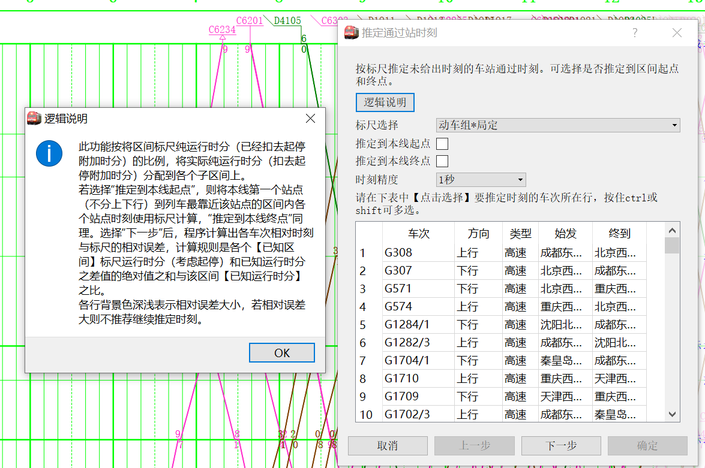
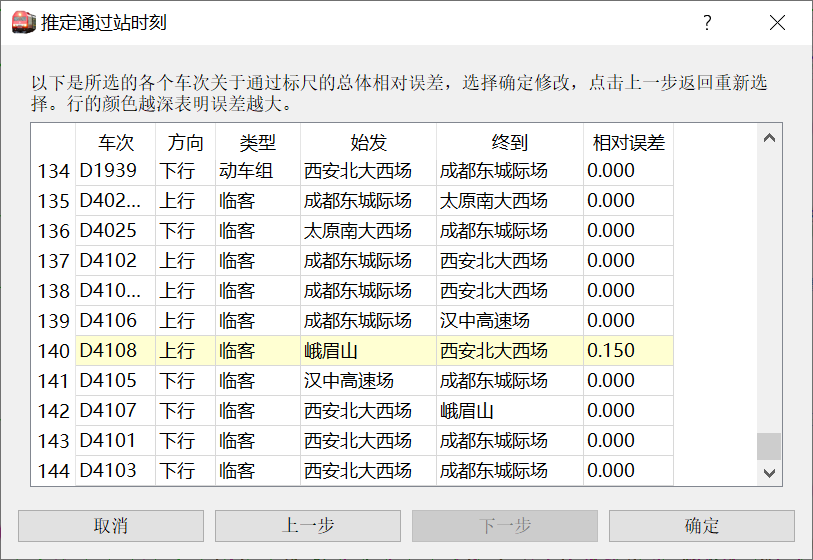
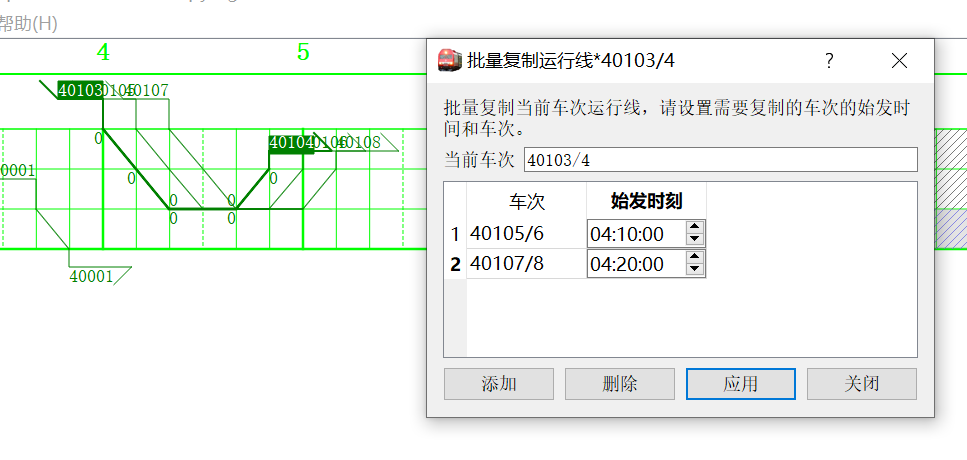
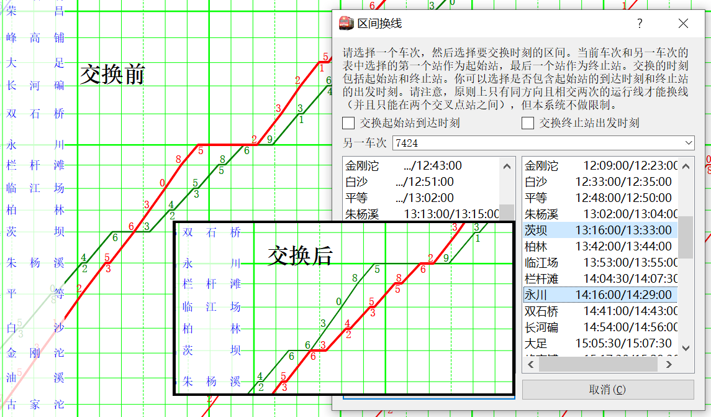
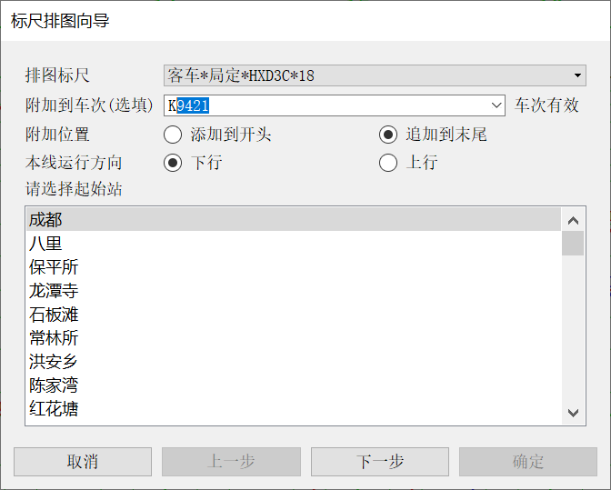
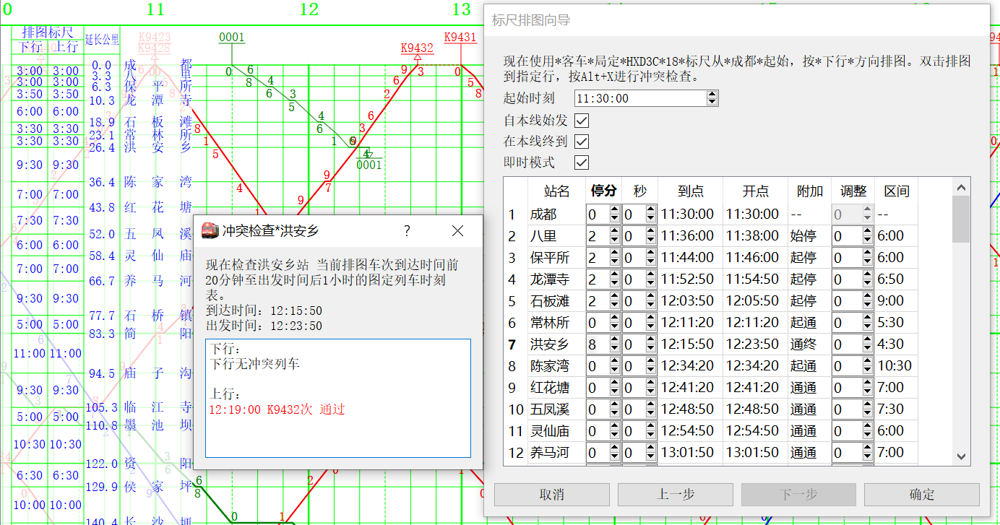
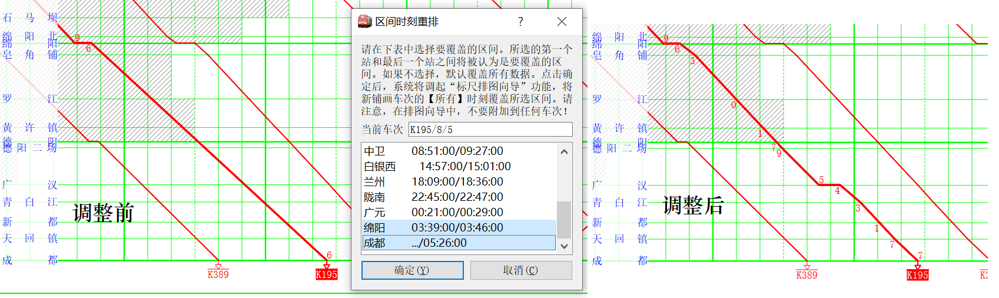

# 高级调整技巧

如何对已有的运行图数据进行修改是一个重要的话题。固然，通过基本的线路信息编辑、车次编辑可以完成大多数的任务，但这样的工作量往往很大，并涉及大量重复的操作。更严重的是，有时候信息是相互牵连的，修改一处就会导致其他数据的变化。例如，通过基本的线路信息编辑改变车站站名后，车次时刻表中的站名并不会随之变化，这将导致原来在本站停车的车次数据不再匹配，也就无法显示这个站的点。

pyETRC系统设计了一些特定场景下的批量调整工具，以减少这样的工作量，用尽可能少的操作完成运行图的调整。本文档将对这些功能进行简要说明，并指出典型的应用场景。本文档将大部分取代以往随发行版发布的`技巧提示.pdf`文件的作用。

运行图调整的情形很多，我们不可能一一列举。如果用户在使用过程中有一些调整场景不能通过已有功能实现，可以提出建议，以便功能进一步完善。

## 单车次时刻调整

一般来说，车次时刻表中的各个车站时刻数据并非是独立的，而是有非常强的牵连的。例如，某个站以前的运行线不变，但在该站由通过改为办客停车，一般来说将导致后面的时刻相应发生变化。此时若逐一去调整后续车站，则非常繁琐并且容易出错，这时可以考虑[区间运行线平移](#区间运行线平移)功能。诸如此类。

本段介绍仅涉及一个车次的时刻表调整操作。这些操作一般是针对**当前车次**的。有关当前车次的概念，参见[运行图铺画](main/overview#运行图铺画)。

### 区间运行线平移

本功能适用于同时调整车次某段（或全部）时刻表的时间，将到发时刻向前或向后平移一段距离。菜单位于`调整->调整当前车次时刻`，快捷键`ctrl+A`。调整界面如下图所示。

在列表中选中需要调整的车站（一般来说，应当是连续的），选择提早或者延后，按确定即生效。

?> 同时，这个窗口也是一个比较简洁、省空间的列车时刻表，便于截图。

### 时刻表修正

在一些情况下，运行图所用的时刻数据由外部程序转换而得到，由于程序的原因，难免出现时刻表顺序错误、到发站时刻颠倒等问题。当然，有时手工输入也会产生这些问题。为此，设计了时刻表修正的功能，通过`调整->当前车次时刻表重排`，或者`当前车次设置`面板中的`顺序重排`按钮，或者快捷键`ctrl+V`调出。

?> 在`2.4.1`版本之后，`当前车次设置`界面直接提供了上下移动车站的功能。但在此之前，上下移动只能通过顺序重排来实现。

如下例是一个顺序错误的例子。显然，尚武、嘉川两站在时刻表上的顺序反了，导致运行线异常，如图：

在对话框表格中，可以看到尚武站与前一站的区间列车运行时间异常，已经用红色背景标出。选中嘉川站所在行，再上移一次，即可改正。

支持的操作在图上皆有说明，不再赘述。

### 交互式时刻微调

到现在为止介绍的直接调整单个车站时刻的方法只有通过`当前车次设置`中表格来调整。这样调整的问题是，调整后必须点击确定才能看到效果；另外`当前车次设置`面板功能过多，留给时刻表的空间有限，且容易误操作。为此设计了交互式时刻调整停靠面板，位于`窗口->交互式时刻表`，快捷键为`ctrl+shift+Y`。界面如下图所示。

每一组中，第二列的第一行为到达时刻，第二行为出发时刻。第三列的第一行为停靠时间，第二行为股道。**调整第二列的时刻后立即生效，重新铺画运行图，且不能撤销**。

第一、三列的文字，红色表示营业，蓝色表示停站但不营业。

双击第一、三列，或者通过右键菜单，可以在营业与不营业之间循环切换。此功能与ETRC相似。

### 运行线外观调整

运行线外观是指运行线的颜色和宽度。我们已经介绍过在`当前车次设置`面板中个别调整的方法，也在[列车类型系统](main/data#列车类型系统)章节中介绍过按照类型设置运行线外观的方法和逻辑。但显然，前者只能一个个改，效率过低；后者又只能通过类别这一种标准来修改，显得过于局限。因此设计了这个功能。

在`车次编辑`停靠面板（`ctrl+C`）选中一组车次，然后点击底部的`批量调整`，在弹出的对话框中即可设置选中车次的运行线外观。

【**例**】按照交路的不同，为每个交路设置一种运行线颜色。

先点击`车次编辑`面板上方的`筛选`，勾选`属于交路`，并选择某一个交路，确定。此时列表中只显示该交路的车次。全部选中，然后点击`批量调整`，设置运行线颜色即可。

?> 车次筛选器的具体用法参见[通用车次筛选器](main/review#通用车次筛选器)。

### 通过时刻推定（插值）

一般情况下，pyETRC的很多功能实现都要求完整的时刻表数据。例如根据跨越站数量自动管理运行线，计算里程等。在一些情况下，已知的数据包含所有停站数据，但不包括通过站的时刻数据（一般在高铁客专中比较常见，也就是没有单纯越行/会让停车情况），此时可以考虑使用通过时刻推定的功能。

?> 通过时刻推定的实质是数值分析中的**插值**问题，其算法类似**分段线性插值**，但比一般的分段线性插值更为复杂，因为考虑到了起停附加时分的问题。

通过时刻推定的依据是**标尺数据**。用户可以选择一套标尺数据，对选中的一组车次进行推定。推定时，**认为所有要推定时刻的无数据车站都是通过**，对每两个有停靠数据的站间，先按照标尺扣去起停附加时分（如果有），再将剩下的区间运行时长，按照各个小区间的**通通时分**比例，分配到各个小区间，从而确定各个区间通过站点的通过时刻。

本功能菜单见`调整->推定通过时刻`，或者用快捷键`ctrl+2`。第一步的界面如下图所示。

!> 使用本功能前，请将`运行图设置`中的`最大跨越站数`设置为充分大的数值，以保证所有需要推定的区间，图上都能看到运行线。

此界面可以选择推定依据的标尺，时刻精度（推定时刻的尾数保留到1秒，5秒，10秒，30秒或1分钟），以及是否要推定到起点、终点。

推定到本线起点是指，对所有车次，如果在本线起点（下行方向起点，或者里程的0点）没有时刻数据，是否从本线入图点开始，推定到本线起点。推定到本线终点，是类似的。

?> 如果推定到起点、终点，则外推部分的区间运行时分标准直接套用标尺数据，而不考虑内插部分的误差。显然，与一般的插值法一样，“外推”的精度低于“内插”的精度。

在表中选择要推定的车次，然后点击`下一步`。**没有选中的车次将不会被推定**。

!> 为了减少计算时的干扰，点击`下一步`时，所选车次时刻表中的**非本线站点**将会被删除。

点击`下一步`后，程序计算出相对误差。相对误差的计算方法如上图所示。背景色深浅标识车次实际（已知）运行时分与标尺数据误差的相对大小。如下图所示。

若相对误差很大，一般来说表明该车次并非是按照所选标尺运行的，或者其中有慢行、停点等情况。此时一般不建议继续推定。若要取消或者新增推定的车次，可以点击`上一步`重新选择。

点击`确定`即将新的时刻数据插入时刻表，并重新铺画运行图。

?> 使用本功能推定出来的时刻，在其`备注`一栏自动标注`推定`。但用户可以撤销，或者新增其他内容。

#### 推定结果的撤销

如果需要撤销上述推定的结果，则可用`调整->撤销全部推定结果`功能，该功能将所有`备注`栏标注`推定`的时刻表信息全部删除。

!> 此功能只检查`备注`一栏的信息，而并不追究时刻是否真的是由推定给出的。这就是说，即使在非推定的数据加上`推定`的备注也会被删除；修改推定出来的结果的备注，则该时刻信息不会被删除。

## 多车次调整

### 运行线批量复制

有时运行图中有一些同方向的、除了始发时刻不同之外，其余运行时刻几乎完全一样的车次，例如沪宁城际的整点标杆车。这种情况下，依次输入或者分别排图都显得太过繁琐。为此，设计了运行线批量平移复制功能。菜单栏`工具->批量复制运行线`，或者快捷键`ctrl+shift+A`。此功能对话框如下图所示

每行一个车次，并依次输入始发时刻（时刻表中第一个站的时刻），点击`应用`即添加新的运行线。如上图所示是以`40103/4`次为蓝本，复制了两个10分钟追踪的车次（图上已经应用了结果）。

### 区间换线

这是一个参照国铁运行图编制系统设计的功能。在两车次运行线发生交叉时，有时候可能需要交换两车次某一个区段的运行线，此时可以用本功能方便地实现。

此功能位于菜单栏`调整->区间换线`，或者快捷键`ctrl+5`。操作界面、操作效果对比如下图所示。

先选中一个车次，调出菜单后，再选择另一车次。在对话框中，左侧一栏是当前车次的时刻，右侧一栏是另一车次的时刻。**分别在两侧选择要交换的范围**（不管选多少个站，范围总是从选择的第一个站到最后一个站），点击`确定`即生效。效果如上图所示。

所选区间的起始站和终止站的到发时刻是否交换，可以由用户决定。在上面这样的例子中，不应当交换。

!> 原则上，只有交叉两次的运行线之间的区段，或者交叉一次、并从交叉点到两车次起点/终点的区间才可以如此交换。但本系统不加限制。若进行不合理的交换，可能导致运行线混乱。

## 运行线铺画

本节介绍与**标尺**有关的运行线设计。标尺是列车区间运行的时分标准，其最重要的作用当然就是计算运行线。由标尺计算运行线是本系统的亮点功能之一。

?> 必须要说明，在本系统中，**标尺与车次之间没有对应关系**，即使车次时刻表是由某个标尺计算出来的。这是因为，一个车次的时刻表可能不符合任何一个标尺；也可能有多个一样的标尺。这种意义下，不容易严格地定义何种情况下列车属于一个标尺。
?> 但作为一个退化了的功能，我们提供了[标尺对照](main/review#标尺对照)功能，提供标尺与实际车次之间的时刻比较。显然，如果按照下面叙述的方法铺画运行线再使用标尺对照，它们应该是完全吻合的。

### 按标尺铺画运行线

菜单栏`工具->标尺排图向导`，或者快捷键`ctrl+R`可以调出本功能。第一个界面如下图所示

首先选择排图标尺、方向。

`附加到车次`一栏选择是否要将排图结果添加到某个车次。如果输入的车次有效，则可选择将新铺画的时刻附加到所要附加车次的开头或者末尾；如果不输入或者车次无效，则**铺画新的运行线**。

!> 附加到车次的功能只适用于在首尾添加一组时刻信息的情况。如果要改变中间某段运行线，请使用[区间运行线重排](#区间运行线重排)功能。

选择起始站并点击`下一步`后，出现第二步的界面，如下图所示（此图并非是上一张图直接点击下一步的结果，而是铺画新车次）。

输入起始时刻，在表中选择各个车站的停车时间，系统自动产生时刻信息。

如果勾选`在本线始发`，则车次始发站被设置为铺画起始站，且第一个区间无条件计算起步附加时分；否则第一个区间是否计算起步附加时分取决于第一个站是否有停点，车次起始站为空。

如果勾选`在本线终到`，则车次的终到站被设置为当前的最后一站（是动态的。随着铺画的延伸，此终到站也会变化）。

若勾选`即时模式`，则在表中调整停靠时间时立即生效，且在图中更新运行线；如果不勾选，**只有双击到一行时，才会铺画运行线到指定行所示站点**。

使用右键菜单，或者快捷键`Alt+X`可查看当前行的冲突时刻，如上图中对话框所示。

表中`调整`一栏可以以秒为单位调整区间运行的时分，调整值可以是正数（增加区间时分，即慢行）或者负数（减少区间时分）。**此调整是临时的，仅在此处生效**。

点击`确定`即生成新运行线和时刻表。

!> 当点击`确定`时，只有图上已经显示运行线的部分才会被提交。这就是说，如果没有勾选`即时模式`，又没有双击过（除第一行外的）表中某一行，则没有数据会被提交，此时系统会提示错误。

如果没有附加到车次（即铺画的是新的运行线），则点击`确定`后会弹出窗口，要求输入车次。输入一不与既有重复的车次即可。如果有附加到车次，则点击`确定`后立即生效，原车次时刻被修改。

?> 如果是附加到车次的状态，则铺画过程中会直接在原车次的基础上展示新运行线。但如果中途取消铺画，则已经铺画的部分作废，不会产生影响。

### 区间运行线重排

有时需要调整既有车次某个区间的停站情况，或者补全某个区间的停站数据（原始数据缺失中间站，但中间站有停点，故不能用[通过时刻推定（插值）](#通过时刻推定（插值）)功能实现），这时可以考虑用本功能，在运行线的某一个区间应用标尺排图。下面用宝成线K195次列车绵阳-成都区间的重排来说明。

先选中K195次运行线，点击`工具-区间运行线重排`，或者快捷键`ctrl+shift+R`打开调整对话框，如下图所示。

在对话框中选择要覆盖排图的区间。选择任意多的站，从选中的第一个站到最后一个站的区间即为要覆盖排图的区间。点击`确定`后弹出标尺排图向导的对话框。

默认情况下，直接进入引用第一套标尺，进入第二步，并自动填好起始站时刻和停车时长。如果需要调整标尺，可以点击上一步重新选择。

标尺排图向导中的剩余操作同[按标尺铺画运行线](#按标尺铺画运行线)。

?> 注意：标尺排图向导中的`自本线始发` `在本线终到`选项是指是否在**当前排图的**起始站和结束站终到。在本例中应勾选`在本线终到`，因为覆盖排图区间的结束站`成都`是本次列车终点站。

?> 本功能实际上等价于，先铺画区间运行线（铺画新车次），再进行[区间换线](#区间换线)，最后删除新铺画的车次。

## 线路数据调整

### 反排运行图

### 拼接运行图

## 站名匹配规则及其调整

### 站名匹配规则

包括域解析符

### 始发终到站匹配规则及其自动适配

### 修改站名和批量调整站名

### 

