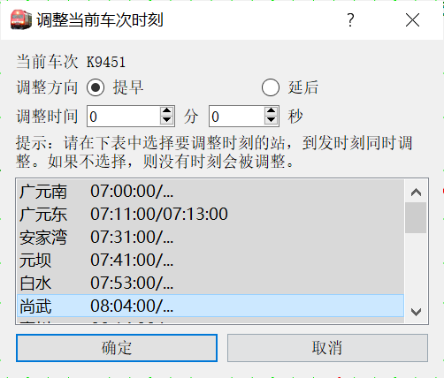
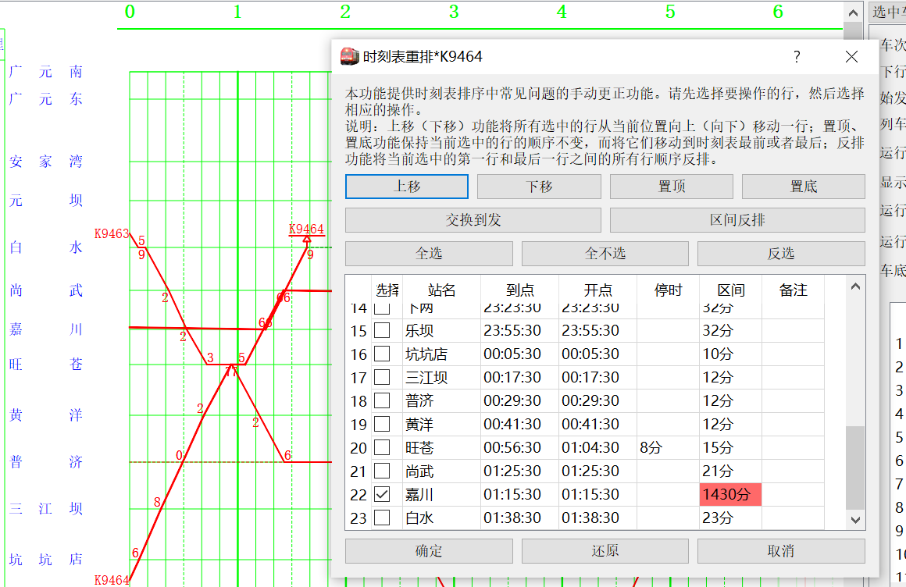
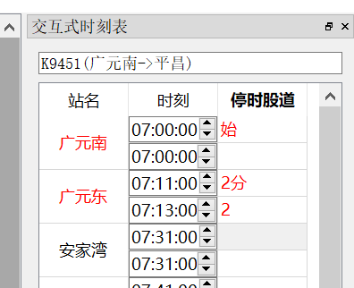

# 高级调整技巧

如何对已有的运行图数据进行修改是一个重要的话题。固然，通过基本的线路信息编辑、车次编辑可以完成大多数的任务，但这样的工作量往往很大，并涉及大量重复的操作。更严重的是，有时候信息是相互牵连的，修改一处就会导致其他数据的变化。例如，通过基本的线路信息编辑改变车站站名后，车次时刻表中的站名并不会随之变化，这将导致原来在本站停车的车次数据不再匹配，也就无法显示这个站的点。

pyETRC系统设计了一些特定场景下的批量调整工具，以减少这样的工作量，用尽可能少的操作完成运行图的调整。本文档将对这些功能进行简要说明，并指出典型的应用场景。本文档将大部分取代以往随发行版发布的`技巧提示.pdf`文件的作用。

运行图调整的情形很多，我们不可能一一列举。如果用户在使用过程中有一些调整场景不能通过已有功能实现，可以提出建议，以便功能进一步完善。

## 单车次时刻调整

一般来说，车次时刻表中的各个车站时刻数据并非是独立的，而是有非常强的牵连的。例如，某个站以前的运行线不变，但在该站由通过改为办客停车，一般来说将导致后面的时刻相应发生变化。此时若逐一去调整后续车站，则非常繁琐并且容易出错，这时可以考虑[区间运行线平移](#区间运行线平移)功能。诸如此类。

本段介绍仅涉及一个车次的时刻表调整操作。这些操作一般是针对**当前车次**的。有关当前车次的概念，参见[运行图铺画](main/overview#运行图铺画)。

### 区间运行线平移

本功能适用于同时调整车次某段（或全部）时刻表的时间，将到发时刻向前或向后平移一段距离。菜单位于`调整->调整当前车次时刻`，快捷键`ctrl+A`。调整界面如下图所示。

在列表中选中需要调整的车站（一般来说，应当是连续的），选择提早或者延后，按确定即生效。

?> 同时，这个窗口也是一个比较简洁、省空间的列车时刻表，便于截图。

### 时刻表修正

在一些情况下，运行图所用的时刻数据由外部程序转换而得到，由于程序的原因，难免出现时刻表顺序错误、到发站时刻颠倒等问题。当然，有时手工输入也会产生这些问题。为此，设计了时刻表修正的功能，通过`调整->当前车次时刻表重排`，或者`当前车次设置`面板中的`顺序重排`按钮，或者快捷键`ctrl+V`调出。

?> 在`2.4.1`版本之后，`当前车次设置`界面直接提供了上下移动车站的功能。但在此之前，上下移动只能通过顺序重排来实现。

如下例是一个顺序错误的例子。显然，尚武、嘉川两站在时刻表上的顺序反了，导致运行线异常，如图：

在对话框表格中，可以看到尚武站与前一站的区间列车运行时间异常，已经用红色背景标出。选中嘉川站所在行，再上移一次，即可改正。

支持的操作在图上皆有说明，不再赘述。

### 交互式时刻微调

到现在为止介绍的直接调整单个车站时刻的方法只有通过`当前车次设置`中表格来调整。这样调整的问题是，调整后必须点击确定才能看到效果；另外`当前车次设置`面板功能过多，留给时刻表的空间有限，且容易误操作。为此设计了交互式时刻调整停靠面板，位于`窗口->交互式时刻表`，快捷键为`ctrl+shift+Y`。界面如下图所示。

每一组中，第二列的第一行为到达时刻，第二行为出发时刻。第三列的第一行为停靠时间，第二行为股道。**调整第二列的时刻后立即生效，重新铺画运行图，且不能撤销**。

第一、三列的文字，红色表示营业，蓝色表示停站但不营业。

双击第一、三列，或者通过右键菜单，可以在营业与不营业之间循环切换。此功能与ETRC相似。

### 运行线外观调整

运行线外观是指运行线的颜色和宽度。我们已经介绍过在`当前车次设置`面板中个别调整的方法，也在[列车类型系统](main/data#列车类型系统)章节中介绍过按照类型设置运行线外观的方法和逻辑。但显然，前者只能一个个改，效率过低；后者又只能通过类别这一种标准来修改，显得过于局限。因此设计了这个功能。

在`车次编辑`停靠面板（`ctrl+C`）选中一组车次，然后点击底部的`批量调整`，在弹出的对话框中即可设置选中车次的运行线外观。

【**例**】按照交路的不同，为每个交路设置一种运行线颜色。

先点击`车次编辑`面板上方的`筛选`，勾选`属于交路`，并选择某一个交路，确定。此时列表中只显示该交路的车次。全部选中，然后点击`批量调整`，设置运行线颜色即可。

?> 车次筛选器的具体用法参见[通用车次筛选器](main/review#通用车次筛选器)。

### 通过时刻推定（插值）

## 多车次调整

### 运行线批量复制

### 区间换线

## 运行线铺画

### 按标尺铺画运行线

### 区间运行线重排

## 线路数据调整

### 反排运行图

### 拼接运行图

## 站名匹配规则及其调整

### 站名匹配规则

包括域解析符

### 始发终到站匹配规则及其自动适配

### 修改站名和批量调整站名

### 

