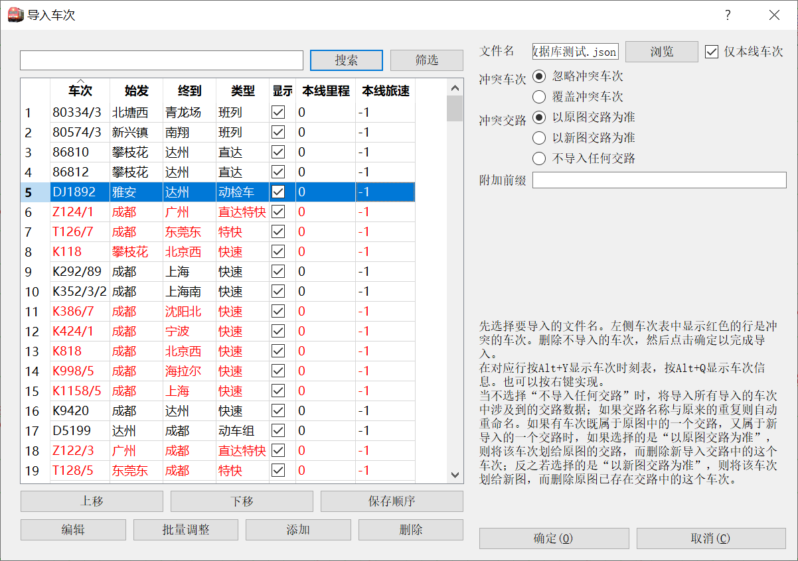

[文档首页](/)  [pyETRC主程序首页](/main/)

# 基础功能

本文档将介绍pyETRC运行图系统主程序的常用铺画、编辑功能。文档中涉及的运行图案例皆为虚构，如有雷同，实属巧合。

## 运行图铺画

程序主界面如下图所示。

窗口左侧依次显示当前排图所用标尺、线路延长公里和站名，上、下边界显示的是时间（小时），中间是运行线。

运行图铺画支持两种模式，即按里程排图和按标尺排图。

当点击一条运行线，则该运行线对应的车次被**选中**，或称为**当前车次**，可以对该车次进行调整，或者查看一些信息。

### 按里程排图

是指纵坐标按照**里程**（下行线里程。参见[线路基础数据](#线路基础数据)）均分坐标的方式，安排车站位置。任何运行图都可以用这种方式排图。按里程排图时，运行图左侧的“排图标尺”栏留空。

### 按标尺排图

按照《铁路行车组织》，运行图铺画一般采用标尺（或时分标准，参见[标尺数据](#标尺数据)）作为纵坐标。在这种模式下，系统以一种选定的标尺数据的**下行**区间时分比例安排车站位置。此时要求所选的标尺必须是**完备**的，也即所有区间都有数据。按这种方式排图时，左侧“排图标尺”栏显示的是所用标尺的区间数据。

## 运行图文件管理

pyETRC运行图文件后缀为`*.pyetgr`，旧版为`*.json`。文件采用JSON(Javascrip Object Notation)格式，`UTF-8`编码。

本系统支持一般的新建空白文件、打开文件、保存文件、另存为文件操作。相关功能见`文件`菜单下，此处不赘。

### 输出运行图

本系统支持以两种形式输出运行图图片。输出的图片是当前运行图的状态，也即如果有车次运行线没有显示，输出文件也不会有；如果选中了车次，输出文件中也将看到选中该车次。

- 输出`PNG`格式图片。功能见文件->导出运行图，快捷键为`ctrl+T`。如此导出的图片是像素图。
- 输出`PDF`格式矢量图。功能见文件->导出矢量pdf运行图。如此导出的运行图是矢量的，支持放大而不失真。一般情况下，推荐使用此功能。

### 与ETRC交互

本系统支持与ETRC列车运行图系统的文件交互。关于ETRC列车运行图系统的简介，可参见[首页](/README.md#与etrc的联系)。

ETRC列车运行图文件后缀为`*.trc`。通过本系统的文件->打开（`ctrl+O`）功能，选择文件类型，可以直接读取`*.trc`文件。通过本系统的文件->导出ETRC运行图(.trc)格式（`ctrl+M`）功能，可以导出ETRC的文件。

**请注意**，由于两系统的功能差异，读入、导出`*.trc`格式的过程会有数据损失。因此读入、导出时，仅仅是创建一个副本；当前运行图的状态应保存到`*.pyetgr`文件中。一般地，如果先导出ETRC文件，再用本系统读入，所得的数据会有变化。

## 运行图数据管理

本系统的数据管理功能较多参考了ETRC列车运行图系统，因此基本逻辑较为相似。但本系统提供了更高精度的数据（线路里程精确到三位小数，列车时刻精确到秒），且数据管理的窗口大多通过停靠面板方式实现。打开、隐藏停靠面板，可使用快捷键，或者“窗口”菜单。

本部分提供基础数据编辑相关的操作指引。但基础数据并不是只能通过编辑创建，更一般的，直接通过外部文件导入。这将留到后文再说。

### 基本逻辑

了解系统的基本逻辑，或许对理解数据管理的相关功能有所帮助。本系统中，一个运行图文件包含**一条**线路信息，即表示一条铁路（或其顺序的组合、或某一段）

> 例如：宝成线广成段；宁芜、皖赣、宣杭线

线路中的车站的关系应该是**线性表**结构的，也即原则上不应该存在分支。

一个运行图文件是一条线路和若干车次的集合。原则上，车次应当经过本线。

原则上，每个车次可以包含**任意多段的运行线**，可以在本线多次入图、出图、折返。

一段**运行线**是指列车在本线上运行的一段**连续、同向**的区间。

> 也就是说，与ETRC不同，不存在“某车次在本线是下行车次”的说法，而只能说“某车次在本线的**某一段运行线**是下行方向的”。

### 线路基础数据

线路数据主要涉及到一个停靠面板，即“线路编辑”面板，通过窗口->线路编辑，或者快捷键`ctrl+X`调出。其主要界面如下图所示。

表中涉及的主要数据说明如下：

- 站名。要求本线的所有站名必须**唯一**。原则上，站名也不能是空白。**站名应按照下行排列**。

- 里程。是指自首站开始的**下行线**延长公里数，可精确到三位小数。单位为公里。原则上首站里程应为0，如果不是0，则点击“确定”时，会提示是否修改为0.

- 对里程。是指自首站开始的**上行线**延长公里数，可选填，精确至三位小数。如果不填，或者填入的不是数字，则按无数据处理。当需要计算上行线里程的区间缺失对里程数据时，则使用“里程”数据（即下行线里程）计算。

- 等级。填自然数。目前仅用于区分是否用粗线显示。

- 显示。如果不勾选，则运行图中不会显示该站的水平线；如果[按标尺排图](#按标尺排图)，则“排图标尺”栏该站上下区间被打通为一个区间。

- 单向站。决定某车站是否为单向通过站。此选项主要对决定数据是否完备有作用。

  > 例如，上图中如果将“广元东”设置为下行单向站，则上行标尺区间为安家湾->广元南，而没有安家湾->广元东和广元东->广元南的数据；此种情况下，上行列车缺少广元东站数据，不会被计入跳过的站数。

- 办客、办货。设置该车站是否办理客运业务和货运业务。默认情况下，客车在办客车站营业，货车在非办客车站营业。

默认情况下，点击“确定”后立即重新排图。但如果“运行图设置”（`ctrl+G`）中没有勾选“自动铺画”，则必须手动刷新才会重新铺画。

### 列车基础数据

列车基础数据是指车次、始发终到、时刻表等信息。更多的数据调整，请参见[高级调整技巧](main/modify.md)节。

#### 车次列表

使用窗口->车次编辑，或快捷键`ctrl+C`可显示或隐藏车次编辑停靠面板。停靠面板如图所示。

表中车次、始发终到、列车种类等信息，可按指定字段排序；选中或取消“显示”，可以控制是否显示运行线，且**立即生效**；点击一行则选中该车次；双击则弹出“当前车次设置”停靠面板。

点击右上角的“筛选”可以选择哪些车次**显示在列表中**，但不显示的车次不会被删除，也不会隐藏运行线。关于筛选的逻辑，请参见[通用车次筛选器](main/review.md#通用车次筛选器)。

上移、下移功能可以调整排列顺序。如果点击“保存顺序”，则下次刷新时，按照当前的车次顺序展示。

点击“编辑”和双击一行效果一致；点击“添加”则弹出“当前车次设置”停靠面板，并可插入新的车次。

可以选中一行或多行后，点击“删除”，删除所有车次。

关于“批量调整”的功能，参见[运行线外观调整](main/modify.md#运行线外观调整)

#### 当前车次设置

使用窗口->选中车次设置，或者快捷键`ctrl+I`可展示或隐藏当前车次设置窗口。这是整个系统中，**最集中的列车数据设置页面**。其界面如下图所示。

输入车次，并以`/`分隔复车次（例如，可以输入`K9451/2`，也可以`K9451/452`等），按`Tab`键后系统自动解析上下行车次（也可手工调整）。

运行线颜色、宽度控制运行图中表示车次的运行线的特征。如果宽度设为0，则系统自动分配。

列车种类详见[列车类型系统](main/data.md#列车类型系统)；运行线管理详见[运行线管理](main/data.md#运行线管理)。

如果当前车次已经属于某个交路，可以从这里编辑或者从交路中撤销；如果当前车次不属于某个交路，则可以在这个页面将其添加到一个交路。交路的更多内容详见[车底交路](main/data.md#车底交路)。

表格中所示是列车时刻表。“营业”一项表示车次在该站是否办理客运或者货运业务。随到点和开点调整，“停时”一栏实时更新，且如果营业，站名显示为红色；如果有停点但不营业，站名显示为蓝色。

营业一栏是否勾选，主要与[车站时刻表](main/review.md#车站时刻表)，[区间分析](main/review#区间分析)中的相关筛选条件有关。

股道一栏可以输入任意字符串；如果留空，则认为没有股道信息。目前股道主要与[车站股道图](main/review.md#车站股道图)功能相关。

备注一栏可以输入任意内容。特别的，在[通过时刻推定（插值）](main/modify.md#通过时刻推定（插值）)中，推定的车站自动加上备注`推定`。

### 标尺数据

列车区间运行时分标准，或列车运行标尺，在本系统中通常简称为**标尺**。有关标尺的意义等，请参阅《铁路行车组织》等相关书籍。这里只介绍本系统中的标尺设定。目前与标尺相关的功能主要有[标尺对照](main/review.md#标尺对照)和[运行线铺画](main/modify.md#运行线铺画)。

点击窗口->标尺编辑，或者快捷键`ctrl+R`可以打开或关闭标尺编辑停靠面板。面板界面如下图所示

原则上一个运行图文件可以有任意多的不同标尺。标尺以名称的不同来区分。对选项和表中的项目做说明如下。

- 上下行分设。表示本标尺的上下行区间时分是否分别设置。如果选中，则“区间”会分别列出所有的上行区间和下行区间；如果不选中，则“区间”一栏的车站分隔符为`<->`。

  特别的，如果本线存在上下行分设站（见[线路基础数据](#线路基础数据)中的“单向站”选项），则“上下行分设”必须选中。
  如果取消勾选，则**上行**数据会被删除。

- 从车次读取。选择本运行图中的一个车次，使用该车次的标尺数据来作为本标尺数据。默认所有车站的起停附加时分都一样（具体值由用户指定）；车次覆盖区间的数据会全部变为车次的运行数据；车次未覆盖区间的数据不变。

- 合并标尺。选择另一标尺，将该标尺的数据合并至本标尺。另一标尺**不会**被删除。可由用户选择，在遇到冲突数据时，以哪一个为准。

- 设为排图标尺。将当前标尺作为纵坐标重新铺画运行图，参见[按标尺排图](#按标尺排图)。请注意此种情况下要求当前标尺必须是完备的。

- 分、秒。表示该区间列车运行的**通通时分**，即两站皆不停靠情况下的区间运行时间。

- 起、停。分别表示，列车在区间前站起步、区间后站停车所需附加的时间，**单位为秒**。

- 距离。此项数据从[线路基础数据](#线路基础数据)中获取，不可编辑。如果没有勾选上下行分设，则使用下行里程。

- 均速。按照《铁路行车组织》，此均速属于**运行速度**，即除去起停附加时分的区间运行平均速率。此数据随区间运行时分的改变实时变化。

?> 如果区间、距离等出现错误，可先在“车次编辑”中点击一次“确定”，再刷新运行图（`F5`）。

以上只是介绍了本系统的最基础数据。关于更多的数据及其操作，请参见[高级数据管理](main/data.md)。

## 运行图显示控制

本系统提供了丰富的运行图显示控制操作，几乎所有的参数都可以由用户指定，以适应个人习惯。但是一般情况下，这些功能并不常用。因此这里仅作简要地介绍。

### 默认配置与运行图配置

与运行图显示控制相关的操作在运行图设置（`ctrl+G`，下图右侧）和系统默认设置（`ctrl+shift+G`，下图左侧）两个停靠面板中。

两者的字段差不多，但作用有不同，因此有必要先讲一下逻辑。

**运行图设置**是指当前运行图的显示配置，仅作用于当前打开的运行图。该配置保存在运行图文件内。

**系统默认设置**是指pyETRC系统的默认配置，该配置保存在**启动目录下的`config.json`**文件中。

当创建新的运行图，或者打开没有配置信息的运行图文件（一般情况下，这是由外部程序给出的运行图文件）时，将自动调用系统默认设置。保存运行图文件（`ctrl+S`）时，<u>将创建配置信息的副本</u>。此后，调整系统默认配置不再自动与当前运行图配置同步，但可以通过“默认”的选项来强制用默认配置覆盖当前配置。

如果启动目录找不到`config.json`文件，或者该文件无法正确解析，则系统根据内置的信息生成默认配置。当用户点击系统默认设置中的“确定”时，默认配置保存到`config.json`文件中。

两者的大多数配置项是一样的，但系统默认设置没有关于具体运行图的配置项。

### 配置项说明

- 起始时刻、结束时刻。以小时为单位配置运行图起止时刻。运行图不必涵盖全天，也即起始时刻和结束时刻不必相同。但如果起始时刻和结束时刻不相同（即没有显示全天运行图），则接近边界处跨越边界的运行线可能有异常。因此，除非某个时段确实没有任何运行线（例如，客运专线的凌晨时段），否则都建议显示完整运行图。

- 默认客车线宽、默认货车线宽。配置不同车次默认的运行线宽度，单位为相对值。关于客车、货车的界定，请参见[列车类型系统](main/data.md#列车类型系统)。除此之外，还可以单独指定车次的线宽，或者批量修改。

- 横轴每像素秒数。用于调整水平方向的显示比例，注意此设定项**反比于**运行图大小，即设定的值越大，运行图越小。

- 纵轴每像素秒数。用于在<u>使用标尺排图时</u>，调整纵向比例。此设定项**反比于**运行图大小。

- 纵轴每公里像素数。用于在<u>使用里程排图时</u>，调整纵向比例。词设定项**正比于**运行图大小。

- 最低粗线等级。当车站等级小于等于此设置项时，显示为粗线。

- 每小时纵线数。控制每小时的区间中有多少条纵线（不包括整小时的线）。默认配置为5，即10分钟一条纵线。半小时线自动为虚线。

- 纵坐标标尺。当前用于铺画运行图的标尺。参见[按标尺排图](#按标尺排图)。

- 有效选择宽度。为方便点击选择运行线而设置。若设置值为`n`（`n>1`），则当鼠标点击到运行线中线为中心、`n`倍于运行线宽度的区域时，都将认为选中了该运行线。

  !> 注意：此功能将带来额外的时间开销。当设置值大于1时，运行图铺画时间会有所延长。

- 最大跨越站数。用于运行线管理。详见[运行线管理](main/data.md#运行线管理)。

- 图中显示时刻。控制运行图中，是否在停点、通过点附近显示运行线的时刻。有三种选项：

  - 不显示
  - 仅选中车次显示
  - 全部显示

  !> 显示的车次只包含分钟的个位数字。如果设置为“全部显示”，运行图铺画时间会有所延长。

- 显示完整车次。默认情况下，运行图中上行的运行线显示上行车次，下行运行线显示下行车次。但若勾选此项，则一律显示完整车次。适用于本线（或其中某一段）有行别不符合车次时，此时可以避免出现大量空白车次。

- 自动铺画。默认勾选。当运行图基础信息发生变化时，自动铺画运行图。如果运行图规模很大，自动铺画耗费很多时间，则可以考虑去掉此项勾选，此时只有强制重新铺画运行图（`shift+F5`）或者刷新（`F5`）时，才会重新铺画。

- 详细尺寸设置。点开后的界面即上图中的对话框，包含更加细致的运行图尺寸等配置信息。

- 默认颜色设置。配置运行图格线颜色，字体颜色和默认情况下各种类型车次的运行线颜色。

  ?> 此外，还可以单独配置各个车次的运行线颜色，或者批量调整。

- 类型管理。详见[列车类型系统](main/data.md#列车类型系统)

- 运行图说明或备注。可以是任何内容。将显示在输出运行图的底部。

?> 由于系统是在150%显示比例的电脑上开发的，故默认的尺寸基本上是基于150%显示比例的，在100%显示比例的系统上，会显得偏大，并且浪费较多空间。此时建议调整有关选项。

## 外部数据的引入

以上介绍的是如何在本系统内部编辑基础数据。固然，本系统对这些数据编辑的支持都是完善的，理论上仅通过本系统就可以编制完整的运行图。但实际操作中，这样的工作过于繁琐，过于耗费时间。因此，数据的导入就显得尤为重要。这里将介绍最基础数据的导入，即线路和车次数据的引入。

### 线路数据的导入

#### 从线路数据库导入

通过数据->线路数据库，或者快捷键`ctrl+H`可以进入线路数据库维护界面。选中线路后，点击“导出到运行图”即可将线路数据引入到当前运行图中。

关于线路数据库的更多内容，参见[线路数据库](main/linedb.md)。

!> 此操作后，当前运行图原有的线路数据将会被覆盖。

`2.3.0`以前的版本使用`ctrl+K`快捷键引入线路数据。旧版本的线路数据保存在`lines.json`文件中。此种导入方式现在被标记为过时，且`lines.json`文件不会继续维护。

#### 从Excel导入

使用数据->导入线路数据(Excel)，或快捷键`ctrl+shift+K`可以从Excel文件中引入线路数据。引入的数据可以有四个字段，即站名、里程、等级、对里程（可选），如下表所示（**表头仅为展示方便，实际输入时，不需要第一行的内容**）。

| 站名       | 里程   | 等级 | 对里程 |
| ---------- | ------ | ---- | ------ |
| 成都西     | 0.000  | 1    | 0.000  |
| 九架线路所 | 3.671  | 5    | 3.671  |
| 温江       | 19.701 | 4    | 19.701 |
| 羊马       | 25.340 | 4    | 25.340 |

!> 执行此操作后，当前运行图的线路数据即被覆盖。

从Excel导入时，仅导入了最基础的数据，更多数据请到“线路编辑”停靠面板中设置。

### 车次数据的导入

使用数据->导入车次，或者快捷键`ctrl+D`，弹出对话框如下图所示。点击右上角的`浏览`选择一个运行图文件或车次数据库文件（`*.pyetdb`），有关车次将列表在左侧的车次管理表中。此对话框左侧界面的操作与[车次列表](#车次列表)所述的一致。

当勾选“仅本线车次”时，只有在本线有两站以上的车次才会被显示；否则指定文件的所有车次都会被显示。

表中与现有运行图冲突的车次用红字显示。右侧可以配置对冲突车次、冲突交路的处理规则。

附加前缀是指，是否要在所有导入的车次前附加某一符号以示区分。用于覆盖旧版本的“导入实际运行线”功能，正常情况下不需要使用。

用户可以通过**删除不需要的车次**来选择要导入的车次。点击“确定”执行导入，并重新铺画运行图。

!> **只有**删除的车次才**不会**导入。也就是说，点击“确定”时，所有没有删除的车次，即使通过“筛选”功能没有显示出来，都将被导入。

#### 旧版注记

旧版本的车次导入有两个功能，即导入车次（`ctrl+alt+D`）和导入实际运行线（`ctrl+shift+D`）。前者选择文件后直接导入，并可选择是否覆盖冲突车次；后者会在所有车次前加上一个`R`以示区分。

旧版本的功能已经完全被新版本覆盖。现在建议使用新版本来导入。