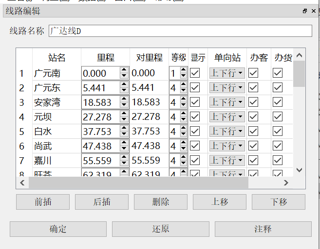

[文档首页](/)  [pyETRC主程序首页](/main/)

# 基础功能

本文档将介绍pyETRC运行图系统主程序的常用铺画、编辑功能。文档中涉及的运行图案例皆为虚构，如有雷同，实属巧合。

## 运行图铺画

程序主界面如下图所示。

窗口左侧依次显示当前排图所用标尺、线路延长公里和站名，上、下边界显示的是时间（小时），中间是运行线。

运行图铺画支持两种模式，即按里程排图和按标尺排图。

当点击一条运行线，则该运行线对应的车次被**选中**，或称为**当前车次**，可以对该车次进行调整，或者查看一些信息。

### 按里程排图

是指纵坐标按照**里程**（下行线里程。参见[线路基础数据](#线路基础数据)）均分坐标的方式，安排车站位置。任何运行图都可以用这种方式排图。按里程排图时，运行图左侧的“排图标尺”栏留空。

### 按标尺排图

按照《铁路行车组织》，运行图铺画一般采用标尺（或时分标准，参见[标尺数据](#标尺数据)）作为纵坐标。在这种模式下，系统以一种选定的标尺数据的**下行**区间时分比例安排车站位置。此时要求所选的标尺必须是**完备**的，也即所有区间都有数据。按这种方式排图时，左侧“排图标尺”栏显示的是所用标尺的区间数据。

## 运行图文件管理

pyETRC运行图文件后缀为`*.pyetgr`，旧版为`*.json`。文件采用JSON(Javascrip Object Notation)格式，`UTF-8`编码。

本系统支持一般的新建空白文件、打开文件、保存文件、另存为文件操作。相关功能见`文件`菜单下，此处不赘。

### 输出运行图

本系统支持以两种形式输出运行图图片。输出的图片是当前运行图的状态，也即如果有车次运行线没有显示，输出文件也不会有；如果选中了车次，输出文件中也将看到选中该车次。

- 输出`PNG`格式图片。功能见文件->导出运行图，快捷键为`ctrl+T`。如此导出的图片是像素图。
- 输出`PDF`格式矢量图。功能见文件->导出矢量pdf运行图。如此导出的运行图是矢量的，支持放大而不失真。一般情况下，推荐使用此功能。

### 与ETRC交互

本系统支持与ETRC列车运行图系统的文件交互。关于ETRC列车运行图系统的简介，可参见[首页](/README.md#与etrc的联系)。

ETRC列车运行图文件后缀为`*.trc`。通过本系统的文件->打开（`ctrl+O`）功能，选择文件类型，可以直接读取`*.trc`文件。通过本系统的文件->导出ETRC运行图(.trc)格式（`ctrl+M`）功能，可以导出ETRC的文件。

**请注意**，由于两系统的功能差异，读入、导出`*.trc`格式的过程会有数据损失。因此读入、导出时，仅仅是创建一个副本；当前运行图的状态应保存到`*.pyetgr`文件中。一般地，如果先导出ETRC文件，再用本系统读入，所得的数据会有变化。

## 运行图数据管理

本系统的数据管理功能较多参考了ETRC列车运行图系统，因此基本逻辑较为相似。但本系统提供了更高精度的数据（线路里程精确到三位小数，列车时刻精确到秒），且数据管理的窗口大多通过停靠面板方式实现。打开、隐藏停靠面板，可使用快捷键，或者“窗口”菜单。

本部分提供基础数据编辑相关的操作指引。但基础数据并不是只能通过编辑创建，更一般的，直接通过外部文件导入。这将留到后文再说。

### 基本逻辑

了解系统的基本逻辑，或许对理解数据管理的相关功能有所帮助。本系统中，一个运行图文件包含**一条**线路信息，即表示一条铁路（或其顺序的组合、或某一段）

> 例如：宝成线广成段；宁芜、皖赣、宣杭线

线路中的车站的关系应该是**线性表**结构的，也即原则上不应该存在分支。

一个运行图文件是一条线路和若干车次的集合。原则上，车次应当经过本线。

原则上，每个车次可以包含**任意多段的运行线**，可以在本线多次入图、出图、折返。

一段**运行线**是指列车在本线上运行的一段**连续、同向**的区间。

> 也就是说，与ETRC不同，不存在“某车次在本线是下行车次”的说法，而只能说“某车次在本线的**某一段运行线**是下行方向的”。

### 线路基础数据

线路数据主要涉及到一个停靠面板，即“线路编辑”面板，通过窗口->线路编辑，或者快捷键`ctrl+X`调出。其主要界面如下图所示。

表中涉及的主要数据说明如下：

- 站名。要求本线的所有站名必须**唯一**。原则上，站名也不能是空白。**站名应按照下行排列**。

- 里程。是指自首站开始的**下行线**延长公里数，可精确到三位小数。单位为公里。原则上首站里程应为0，如果不是0，则点击“确定”时，会提示是否修改为0.

- 对里程。是指自首站开始的**上行线**延长公里数，可选填，精确至三位小数。如果不填，或者填入的不是数字，则按无数据处理。当需要计算上行线里程的区间缺失对里程数据时，则使用“里程”数据（即下行线里程）计算。

- 等级。填自然数。目前仅用于区分是否用粗线显示。

- 显示。如果不勾选，则运行图中不会显示该站的水平线；如果[按标尺排图](#按标尺排图)，则“排图标尺”栏该站上下区间被打通为一个区间。

- 单向站。决定某车站是否为单向通过站。此选项主要对决定数据是否完备有作用。

  > 例如，上图中如果将“广元东”设置为下行单向站，则上行标尺区间为安家湾->广元南，而没有安家湾->广元东和广元东->广元南的数据；此种情况下，上行列车缺少广元东站数据，不会被计入跳过的站数。

- 办客、办货。设置该车站是否办理客运业务和货运业务。默认情况下，客车在办客车站营业，货车在非办客车站营业。

默认情况下，点击“确定”后立即重新排图。但如果“运行图设置”（`ctrl+G`）中没有勾选“自动铺画”，则必须手动刷新才会重新铺画。

### 列车基础数据

列车基础数据是指车次、始发终到、时刻表等信息。更多的数据调整，请参见[高级调整技巧](main/modify.md)节。

#### 车次列表

使用窗口->车次编辑，或快捷键`ctrl+C`可显示或隐藏车次编辑停靠面板。停靠面板如图所示。

表中车次、始发终到、列车种类等信息，可按指定字段排序；选中或取消“显示”，可以控制是否显示运行线，且**立即生效**；点击一行则选中该车次；双击则弹出“当前车次设置”停靠面板。

上移、下移功能可以调整排列顺序。如果点击“保存顺序”，则下次刷新时，按照当前的车次顺序展示。

点击“编辑”和双击一行效果一致；点击“添加”则弹出“当前车次设置”停靠面板，并可插入新的车次。

可以选中一行或多行后，点击“删除”，删除所有车次。

关于“批量调整”的功能，参见[运行线外观调整](main/modify.md#运行线外观调整)

#### 当前车次设置

使用窗口->选中车次设置，或者快捷键`ctrl+I`可展示或隐藏当前车次设置窗口。这是整个系统中，**最集中的列车数据设置页面**。其界面如下图所示。

输入车次，并以`/`分隔复车次（例如，可以输入`K9451/2`，也可以`K9451/452`等），按`Tab`键后系统自动解析上下行车次（也可手工调整）。

运行线颜色、宽度控制运行图中表示车次的运行线的特征。如果宽度设为0，则系统自动分配。

列车种类详见[列车类型系统](main/data.md#列车类型系统)；运行线管理详见[运行线管理](main/data.md#运行线管理)。

如果当前车次已经属于某个交路，可以从这里编辑或者从交路中撤销；如果当前车次不属于某个交路，则可以在这个页面将其添加到一个交路。交路的更多内容详见[车底交路](main/data.md#车底交路)。

表格中所示是列车时刻表。“营业”一项表示车次在该站是否办理客运或者货运业务。随到点和开点调整，“停时”一栏实时更新，且如果营业，站名显示为红色；如果有停点但不营业，站名显示为蓝色。

营业一栏是否勾选，主要与[车站时刻表](main/review.md#车站时刻表)，[区间分析](main/review#区间分析)中的相关筛选条件有关。

股道一栏可以输入任意字符串；如果留空，则认为没有股道信息。目前股道主要与[车站股道图](main/review.md#车站股道图)功能相关。

备注一栏可以输入任意内容。特别的，在[通过时刻推定（插值）](main/modify.md#通过时刻推定（插值）)中，推定的车站自动加上备注`推定`。

### 标尺数据

