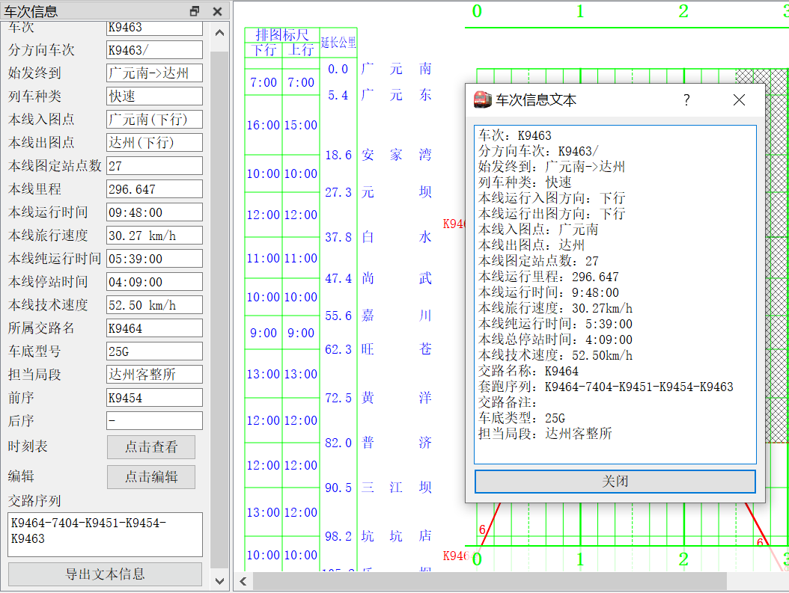
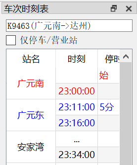
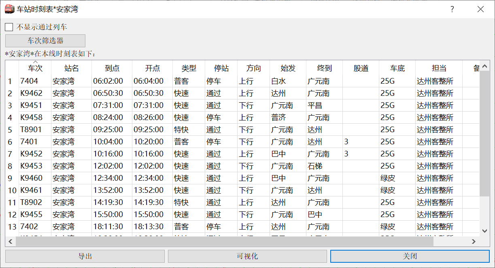
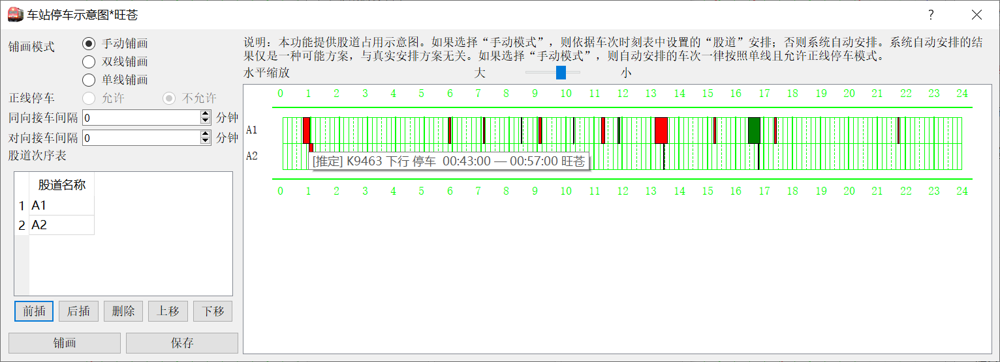
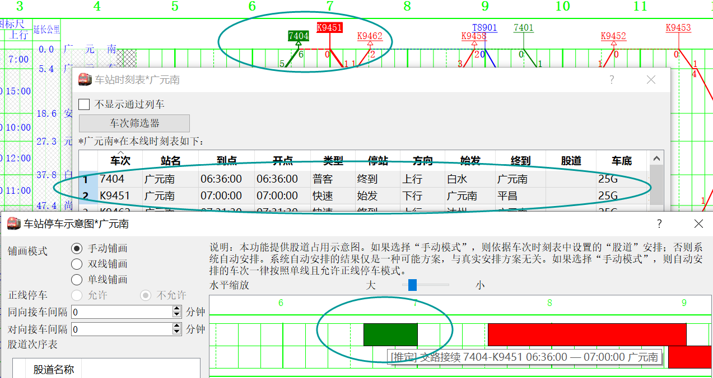
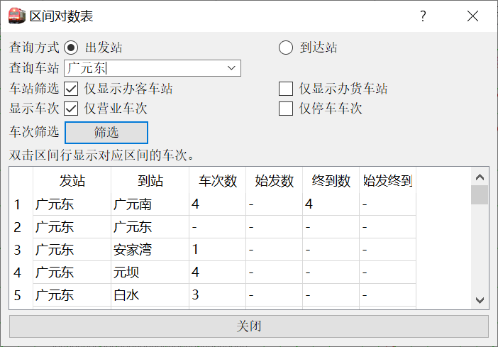
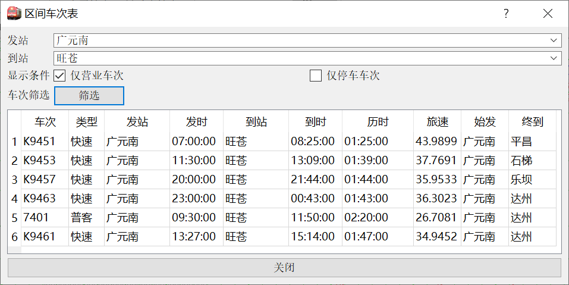

# 运行图审阅

本文档主要介绍基于已有运行图的一些数据展示、分析功能，尤其是在不改变运行图数据情况下的分析。当然，运行图数据与分析是紧密联系的，不可能截然的分开。因此出于各种逻辑考虑，有一些分析功能不再本文档中，本文档中也有少量的修改运行图数据操作。

这篇文档基于pyETRC V3.1版本编写。

## 基本数据

在我们的文档中，“基本数据”或者“基础数据”一般指的是任何运行图都会有的、往往还是系统强制需要设置的数据，例如车站里程数据，车次时刻数据等。

### 运行图信息

`运行图信息`功能给出和本线、运行图相关的基本统计信息。为了方便，直接以文本形式给出。通过菜单栏的`查看-运行图信息`，或者新版工具栏的`线路-运行图信息`可以打开。以下是一个示例输出。

```
线名：京沪线上局段
文件名：D:/京沪线上局段.json
里程：685.0km
起点站：利国
终点站：上海
站点数：82
车次数：797
下行车次数：395
上行车次数：402
```

### 列车信息

与`运行图信息`相对应，我们提供了`列车信息`功能显示车次的基本信息，及车次主要操作的导引。

?> 这个功能设计成**只读**的，从这个界面不能直接修改车次数据和时刻表，但提供了导向时刻表和编辑界面的快捷操作。设计中，可以作为**常开**的停靠面板。

通过快捷键`Ctrl+Q`、菜单栏`窗口->车次信息`、工具栏`列车->信息`可以打开或关闭。界面如下图所示。



点击`时刻表`弹出[列车时刻表](#列车时刻表)面板；点击`编辑`弹出`当前车次设置`面板。点击`导出文本信息`显示上图所示的对话框。这实际上是旧版的车次信息功能，文本中包含的信息与面板中一致。

### 列车时刻表

为了更**方便**和**安全**地查看列车时刻表，比照ETRC的时刻表，本系统提供了**只读**的列车时刻表（但只是单个车次的时刻表，而不是全局的），也是设计成常开的停靠面板。通过以下任一方法可打开此面板：

- 快捷键`Ctrl+Y`
- 菜单栏`窗口->车次时刻表`
- 工具栏`列车->时刻表`（大图标）
- 双击车次运行线

为了减少水平空间的占用，时刻表采用双行的设计。界面如下图所示。



文字颜色的规定与`当前车次设置`中一致，即红色字表示该站营业、蓝色字表示停车但不营业、黑色表示其他。

## 车站分析

### 车站时刻表

车站时刻表功能提供了针对车站的、以车次为单位的时刻表，并尽量展示了与车次及其停站相关的数据。从菜单栏`查看->车站时刻表输出`、工具栏`线路->车站时刻`（大图标）或者快捷键`Ctrl+E`可以调出。在弹出的对话框中选择车站，然后看到以下对话框：



其中，`导出`可以将以上表格数据导出到Excel表中。`可视化`将调出[车站股道图](#车站股道图)功能。表中可以对各列排序。

### 车站股道图

在[车站时刻表](#车站时刻表)中选择底部的`可视化`打开本功能。本功能提供车站股道安排的图形化表示。既可以使用用户提供的股道数据，也可以使用系统按照特定算法排出的股道。自然，本系统排出的结果仅供参考。本功能的界面如下图所示。



右侧图中的横轴为时间（与运行图中一致），纵轴每一格（即每一行）为一条股道，每一个色块表示一个车次在本站占用股道的时间段。色块的颜色由车次运行线的颜色决定（如果是交路接续，以后车为准）。

对于通过的车次，其股道占用时间一般按照1分钟处理。

将鼠标放在车次色块上可以看到车次停车的具体信息。其中，`[推定]`表示该车次的股道信息由本系统推定给出，`[图定]`表示该车次的股道信息由用户输入。车次股道信息的编辑请移步`当前车次设置`（`ctrl+I`）面板。

左侧的设置项将分成下面几个子目分别介绍。

#### 铺画模式和自动铺画逻辑

在左侧的`铺画模式`栏目设置。其中，`手动铺画`表示应用车次设置的股道信息来铺画，而没有股道数据的，按照**单线、允许正线停车**模式来自动安排。另外两项都不使用用户设定的股道信息，而完全由本系统的逻辑来安排股道。

各种铺画模式下的股道名称及其意义为：

- **单线铺画**。车站股道为`Ⅰ, 2, 3, ...`。其中`Ⅰ`道为**正线**，其他为侧线。

- **双线铺画**。车站股道为`..., 3, Ⅰ, Ⅱ, 4, ...`。其中`Ⅰ`、`Ⅱ`道分别为下行、上行的正线，其他单数股道为下行侧线，双数股道为上行侧线。这种模式多见于新建客运专线中间站。

- **手动铺画**。首先使用车次数据中的股道信息，建立所有车次中出现的所有股道。对于没有股道信息的车次，首先在已有股道中安排，如果股道不够用，则新建股道名称为`A1, A2, ...`。对于车次中的股道信息，本系统以**字符串匹配**方式进行匹配，这就是说，`1`和`01`将指向不同的股道。

  ?> 手动铺画模式强制按照用户给出的股道安排，即使出现冲突；如果出现冲突，将弹出警告信息。

自动铺画时，对于每一车次，系统先行查看所有既有股道是否能接发该次列车（如果允许`正线停车`，则从正线开始，否则从第一侧线开始），如果有则安排到第一个能接发的股道，否则新建股道。

`同向接车间隔`是指，同一股道上，同行别的两车次，只有前车出发时间和后车到达时间之间的间隔大于或等于设定值时，这样的安排才是有效的。`对向接车间隔`则相应指不同行别的两车次，且只适用于单线铺画模式下。

默认情况下两个接车间隔都为0，即只要两车次占用股道时间不重叠，即可接发。

#### 股道顺序安排

左侧的`股道次序表`可以指定各股道名称，及其（在图上从上到下的）安排次序。**此设置仅在`手动铺画`模式下有效**，自动铺画时，股道全部由系统自动安排。

点击`保存`可以将当前表中的股道顺序安排表保存到线路数据中，此项操作随着运行图文件的保存而永久保存到文件。下次打开时，首先加载线路数据中的股道表。点击`铺画`可按照上面设置的铺画模式、股道表来重新铺画股道分布图。

股道次序的安排遵循如下规则。

- 在`手动铺画`模式下（启动时默认是这样的），如果线路数据中有股道信息、或者用户已经设置过股道信息然后点击`铺画`，则系统首先将股道信息表中的股道按顺序安排（即使有的股道并没有图定车使用，也会安排）。

- 如果有的车次停站信息中的股道不在股道表中，则在后面追加该股道。增加股道的顺序是不确定的（事实上，取决于扫描车次的顺序）。

  ?> 例如，如果某站股道表为`Ⅰ, 2, 3`，某车次在该站停靠股道为`1`，则该股道不在股道表中，股道信息将变为`Ⅰ, 2, 3, 1`。我们再次强调，股道匹配是按照**字符串匹配**的原则进行的。

- 对于没有股道信息的车次，系统将尝试安排到既有股道；如果既有股道都不能安排该车次，则新建股道，新建股道命名格式为`A1, A2, ...`。

- 在手动铺画模式下，如果没有输入的股道次序信息（即：线路信息中的股道次序表，或者用户指定的股道次序表），则将所有车次信息中的股道添加到股道表后，进行一次**基于字符串比较**的排序。

?> 我们看到，对于按照车次提供的股道信息和系统自动安排股道的混合情况，系统的处理是不可靠的。因此，我们建议，如果要使用手动铺画，请尽量提供**完整的信息**。

#### 交路接续逻辑

作为[车底交路](main/data#车底交路)功能的开发目的之一和重要用途，在股道占用分析中，无论自动铺画还是手动铺画，都将利用交路信息。

##### 设计背景

在正式说明交路接续的逻辑之前，我们先介绍一下此功能的设计背景及以往的解决方案，或者也可以说是替代方案。如果不希望花时间了解这些细节，可跳过本节。

在运行图中，各个车次是独立的。对于始发终到的列车，一般始发站不存在到达时刻，终到站不存在出发时刻（虽然本系统还是保留了这两项数据），但一般来说始发终到站的到开时刻是一样的，在股道分析、事件分析时，和通过站的结构差不多。即使在本系统引入了始发终到站的字符串匹配方法后，可以将它们和通过区分开，但还是无从得知始发终到站的股道占用时长。很显然，在实际情况，始发车总是有前序车次（或是出库，或是上一终到车次），车底总会占用一定的股道；终到车亦然。

默认情况下，虽然识别出了始发终到信息，但由于没有更多信息，系统仍按`通过`处理，即占用股道1分钟。但这显然是不合实际的；一般需要使用股道分析的站都是大站，会有较多始发终到的情况，这使得本功能的可用性大大降低。

在引入交路功能之前，有一种**替代方案**，即利用终到车次的`出发时刻`，将其设为后序车次的始发时刻，或者反过来，将始发车次的`到达时刻`设为前序车次的终到时刻。这样虽然能一定程度解决问题，但仍有以下问题或者困难（以下我们以修改**终到车次**时刻的方案为例探讨）：

- 手动输入时刻工作量较大，且容易出错。
- 影响车次在本线运行的时间、均速等参数的计算。
- 终到车次的终到标签与实际终到点距离较远，影响看图。
- 大站有大量车次始发终到，则该站水平线上总是有较多的车次运行线叠压，影响看图。
- 接续的两个车次仍为独立的，仍然会作为两个独立车次安排股道；在自动铺画中，并不能保证两车次被安排到同一股道（一般情况下，就是不在同一股道上），造成多余数据的干扰。这也是**最严重和最本质的一点**。

##### 逻辑和显示

以上介绍了此功能设计的背景。下面说明具体的展示形式和逻辑。

两车次被判定为接续车次，**当且仅当**满足[运行线连接](main/data#运行线连接)的条件。这就是说，交路接续所占用的股道，可以理解为运行图中连接运行线的虚线占用的股道。

当车次连接时，其车次在图上将标注为`交路接续`，并且其行别按照**后续车**行别来处理。例如，在下图中，画圈的三处所指的是同一件事，即两车次的接续。




## 区间分析

我们这里说的`区间`，是指两个车站之间，特别是本线的两站之间的区间。但本系统只检查点对点的数据，而不关心两点之间是否经由本线运行。

### 区间对数表

区间对数表功能统计本线各个区间的的车次数量，以单源点或者单阱点的形式展示。菜单栏为`查看->区间对数表`，快捷键为`ctrl+3`。示例界面如下图所示。



选择`出发站`时，查询所选车站到符合条件的各个车站的符合条件车次数；选择`到达站`时，则查询符合条件的各个车站到所选车站的符合条件的车次数。

通过`车站筛选`可以选择是否只显示办客车站或者办货车站。关于车站办客/办货与否的设置，请打开`线路编辑`(`ctrl+X`)面板。此选项便于减少干扰项，只显示需要显示的。

`显示车次`选项控制是否只统计在指定区间端点两个站营业或者停车的车次。注意，作为特别处理，**始发、终到总是被作为停车处理**，即使始发终到站的时刻表到开时刻可能（并且往往）是一样的。

`车次筛选`将调用[通用车次筛选器](#通用车次筛选器)进一步筛选统计范围。

表中`车次数`一列的数据，是指从该行`发站`至`到站`区间的，符合`显示车次`筛选条件、符合车次筛选器筛选条件的车次的数量。`始发数`一列指的是`车次数`所指的一组车次中，在`发站`始发的数量，`终到数`是类似的；`始发终到数`则是指在`发站`所示站始发**且**在`到站`所示站终到的车次的数量。如果数据是0，则显示为`-`。

本功能计数时**并不**检查车次在发站、到站之间，是否经由本线运行。本功能仅限查询本线车站。

?> 双击表中的一行，可以查看该区间的[区间车次表](#区间车次表)。

### 区间车次表

类似于12306的查询区间车次，本系统设计了区间车次表功能，显示指定区间的具体车次及其相关信息。菜单栏位于`查看->区间车次表`；快捷键为`ctrl+shift+3`。主界面如下图所示。



`发站`、`到站`栏选择或输入要查询的车站。可以在下拉框中选择本线的车站，但本功能的查询**不限于本线车站**。

`仅营业车次`选项控制是否只显示在`发站`、`到站`都营业的车次；`仅停车车次`是类似的。需注意始发终到也被视作停车。

### 区间性质计算

## 列车时刻分析

### 标尺对照

### 两车次对照

### 运行图对比

## 显示与查找

### 通用车次筛选器

### 显示车次筛选

### 车次查找


